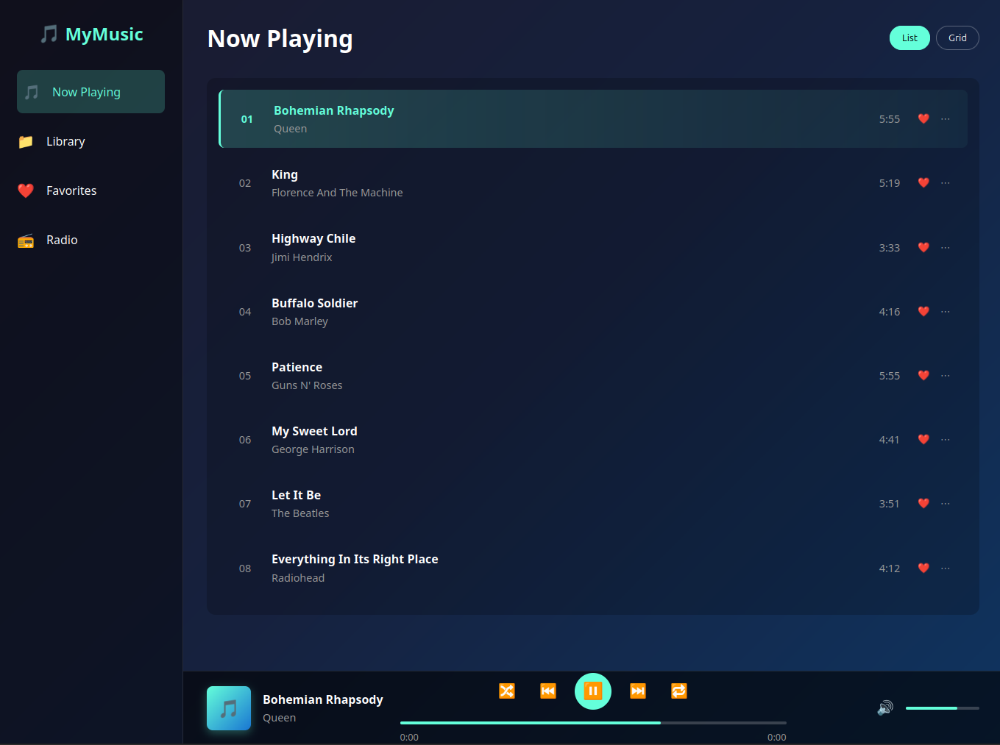

# Music Dashboard - Week 2 CSS & JavaScript Mini Project



## Overview

This is a capstone project for Week 2 that showcases how HTML, CSS, and JavaScript work together to create dynamic web applications. Students build an interactive music dashboard similar to Spotify or Apple Music.

The project embodies the theme: **"CSS creates possibilities, JavaScript activates them."**

## Project Structure

```
├── README.md                 # This overview
├── package.json              # Testing dependencies and project configuration
├── .gitignore               # Git ignore rules
├── assets/
│   └── music_player_demo.png # Demo image
└── lab/
    ├── README.md             # Detailed lab instructions
    ├── jest.setup.js         # Test configuration
    ├── script-starter.js     # JavaScript starter code
    └── test.js              # Automated tests
```

## What Students Will Build

A complete music dashboard featuring:
- **Visual Interface (Stage 1)**: Sidebar navigation, song list, and playback controls using HTML & CSS
- **Interactive Features (Stage 2)**: Click-to-play songs, play/pause controls, track navigation using JavaScript

## Key Learning Objectives

- **HTML Structure**: Semantic markup with proper IDs and classes for JavaScript integration
- **CSS Layout**: Modern layouts using Flexbox/Grid, styling interactive states
- **JavaScript Interactivity**: Event handling, DOM manipulation, state management
- **Integration**: How the three technologies work together in real applications

## Two-Stage Approach

1. **Stage 1 (HTML + CSS)**: Build the complete visual foundation - layout, styling, and all visual states
2. **Stage 2 (JavaScript)**: Add interactivity that activates the CSS styles created in Stage 1

This approach helps students understand that JavaScript enhances and activates possibilities that CSS creates, rather than handling all the visual work itself.

## Getting Started

Navigate to the `lab/` directory and follow the detailed instructions in the lab README to begin the project.

## Testing

The project includes automated tests to verify:
- Required HTML structure and IDs/classes
- Proper CSS layout implementation  
- JavaScript functionality and event handling
